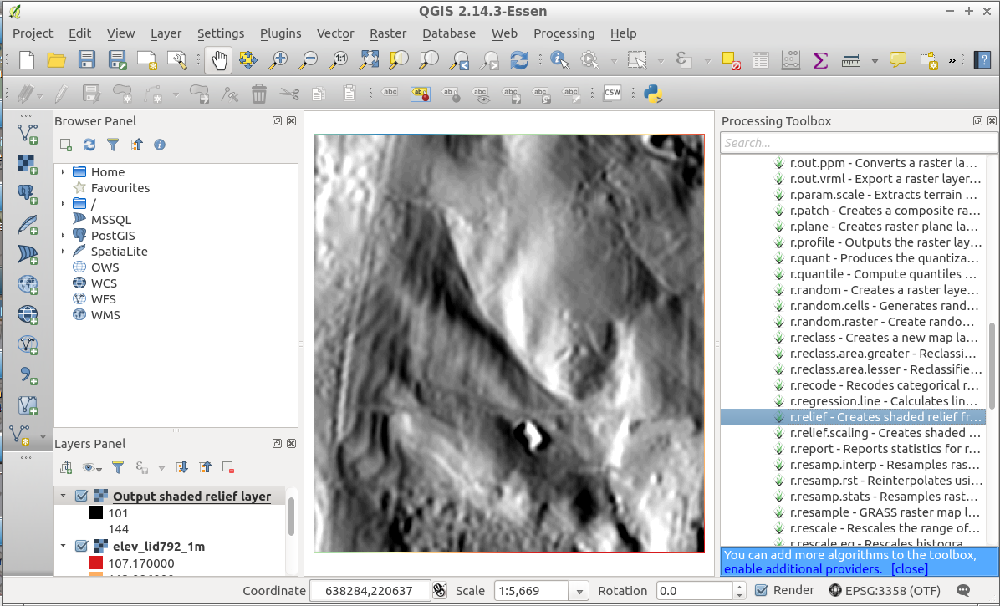

#First Steps


###Session Objectives
* Starting OSGeo-Live
 * ... of GRASS GIS 7
 * … of QGIS
* Download of related course data
* Using GRASS GIS in QGIS through “Processing”
___
___
##<span style="color:red">*Preparation*</span> - Starting OSGeoLive

[OSGeo-Live](http://download.osgeo.org/livedvd) ISO available


Copy to DVD or USB flash drive, then boot from flash drive;
or run it in a Virtual Machine environment.

See: [quickstart](https://live.osgeo.org/en/quickstart/osgeolive_quickstart.html)


...sit back while the system boots up...


**Optional**: Configuration of region settings:
OSGeo-Live [Internationalisation Quickstart](https://live.osgeo.org/en/quickstart/internationalisation_quickstart.html)


Keyboard layout switcher:
To add a “flag” icon to the lower menu panel, do the following steps:


**Optional**: Configuration of **keyboard layout**


___
Configuration of region settings if needed:
OSGeo-Live [Internationalisation Quickstart](https://live.osgeo.org/en/quickstart/internationalisation_quickstart.html) (language + keyboard layout):


Update of **language settings**:

For the **menus**: Logout > Change language in top menu > Login again.

Authentication:

		User: user
		Password: user


Missing language?
Set it via the **main applications menu**
```
Preferences
		> Language Support
			> Install/Remove languages
```
___

###Web Download of course data sets
Please create a “_gis_data_” directory for the course data:

	cd $HOME
	mkdir gis_data

Download data from: [mundialis.de](https://www.mundialis.de/workshops/osgeo_ireland2017/)
_WORKSHOP NAME BEI MUNDIALIS.DE noch ändern_!!!!

	folder: north_carolina/ 
	- nc_zipcodes_wake_SHP.zip 		308 KB
	- elev_ncstate_500m_tif.zip      1.8 MB
	- elev_lid792_1m_tif.zip			1.7 MB

	  [...]


Save these **3 files** your computer into the new “gis_data” directory and unpack them.

The other files we'll download later.

The maps are located in [North Carolina](https://en.wikipedia.org/wiki/North_Carolina), USA.
___
###OSGeo-live: North Carolina sample data set
**Duplikatseite Nr. 8?**

___
###Unpacking the course data set
Unpacking of the  nc_zipcodes_wake_SHP.zip|.tar.gz 
(ZIP codes map of Wake county in North Carolina)

<span style="color:green">*Linux*</span>:

+ Create a directory “gis_data” in your home directory and unpack the file therein as follows (or use a graphical program):


	mkdir $HOME/gis_data
	cd $HOME/gis_data
	tar xvfz /path/to/nc_zipcodes_wake_SHP.tar.gz

<span style="color:green">*Mac OSX*</span>:

+ Create a directory “gis_data” in your home directory and unpack the nc_zipcodes_wake_SHP.zip file therein.

<span style="color:green">*MS-Windows*</span>:

+ Create a directory “gis_data” in your home directory  and unpack the nc_zipcodes_wake_SHP.zip file therein
Note: avoid white space in the path as well as non-ASCII characters (it may work, though)

___
##<span style="color:red">QGIS</span>: “GRASS Toolbox” versus “Processing”

**Two ways of using GRASS GIS from QGIS**


**GRASS Toolbox**
+ “traditional” GRASS GIS support in QGIS
+ Connects directly to GRASS: uses region information and reads/writes GRASS data format directly

**Processing** (formerly SEXTANTE) → GRASS GIS provider
+ “new” GRASS GIS support
+ Runs GRASS GIS in a temporary session for each calculation
+ … using GRASS GIS from QGIS (internal batch job mode)


The choice is up to the user...
 
So, which one? We will now use “Processing”!

**Start QGIS** from “Desktop GIS” in OSGeoLive
___
##<span style="color:red">QGIS-Processing</span> - Using QGIS and Processing


##<span style="color:red">Vector</span>  exercise: dissolve


**Dissolving geometry by string column attributes:**
+ SHAPE file is preselected according to legend
+ Select “NAME” column for dissolving
+ Run

**Processing** calls GRASS GIS in a temporal session which deliver the result back (here: SHAPE file)

___

##<span style="color:red">Raster</span> exercise: loading a 1m LiDAR map 


####styling the elevation map

####hillshading
Please try yourself...



