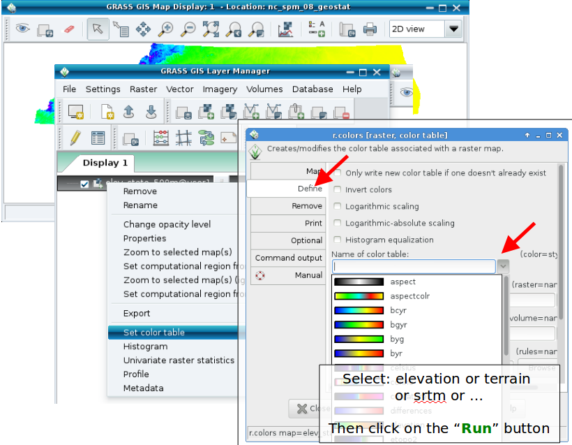
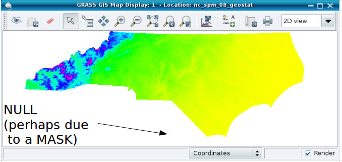

#GRASS GIS 7 RASTER intro
 


###Session Objectives
+ GRASS GIS raster processing concepts
+ Import of a GeoTIFF (DEM)
+ Applying a color table to the DEM
+ Raster: NULL values and MASK
+ Working with the computational region
+ Region and raster map import/export
+ Raster map export
+ Simple hydrological modelling
+ Raster capabilities in GRASS GIS

___
___
##computational region concept
<span style="color:green">**Computational region**</span>
+ defined by region extent and raster resolution
+ applies to raster operations

<span style="color:green">**Raster map region**</span>
+ defined by map extents and map resolution
+ each raster map has its own values
+ <span style="color:red">reality checkcomputational region overrides raster region </span>


<span style="color:green">**Display region**</span>
+ extents of the current map display
+ independent of the current computational region and the raster region
+ user can set the current computational region from display region
___

##<span style="color:red">*Exercise*</span> – Import of a GeoTIFF (DEM)
Since GRASS handles data in its own format, GIS files need to be imported (r.in.gdal/r.import) or just registered (r.external):


___
###Applying a color table to DEM


___
###Raster: NULL values and MASK
<span style="color:green">NULL values</span>: no value – e.g. gaps in DEM


<span style="color:green">MASK (i.e., a raster map with this name, capital letters): </span>
+ MASK'ed cells are read as NULL cells -> usually <span style="color:green">skipped</span> (also all areas outside the computation region)


___
##<span style="color:red">*Exercise*</span>– Working with MASKs

Load the “zipcodes” raster map into the Layer Manager and display it.

Set the computational region to the map (via right mouse button) or with

```g.region raster=zipcodes -p```

Now we want to pick only one ZIP code and restrict subsequent calculations to only that part.
+ List raster attributes (or use query tool on map):

```r.category zipcodes```
+ Set the MASK (here: using a raster map, also vector maps are supported – an inverse mask can be set adding the -i flag):

```r.mask raster=zipcodes maskcats=27605```

+ Now display the map again (“Render map” icon) to see only that particular area of the “zipcodes” map

Note: the computational region is not updated by that.

MASK removal: r.mask -r

___
###Working with the region
Print values of computational region (valid for the active MAPSET)
command:
```g.region -p```

**wxGUI**: Settings -> Region -> Set region


___
###Raster map import/export
**Import of raster maps**
+ r.in.* modules
+ <span style="color:blue">r.import</span> (it also offers reprojection on the fly)!

+ Always the <span style="color:red">full</span> maps are imported.


**Export of raster maps**
+ r.out.* modules

+ <span style="color:red">!! Raster export adheres to computational region (and respects also a MASK if present)</span> 

+ r.out.gdal for export


GDAL supports > **140** raster formats.


Raster export via **GDAL**

command: ```r.out.gdal```

wxGUI: File -> Export raster map -> Common export formats


####<span style="color:red">Exercise:</span> 

Set region to some raster map

```>g.region -p raster=<raster>```

export this raster with **r.out.gdal**

```> r.out.gdal input=<raster> output=<raster>.tif```

Now
+ display this raster map
+ zoom in
+ set region from display (icon)
+ export again with *r.out.gdal*
+ compare the size of the two exported raster maps
+ compare output of gdalinfo

**Note: White space in path needs quoting with “<span style="color:blue">C:\PATH</span> TO\...”**

___
###Hydrological modelling
set computational region to map (using map metadata)

```g.region raster=elev_lid792_1m -p```

flow accumulation with MFD

```r.watershed elevation=elev_lid792_1m accumulation=flowacc```


check map list

```g.list raster```

show metadata

```r.info flowacc```

 now look at map in map display
####Hydrological analysis: <span style="color:green">reality check


**Perspective view of flow accumulation:**

Create a nice perspective view
+ Load and highlight the “elev_lid792_1m” raster map in the layer manager
+ In the map display, switch to “3D view” – in the upper right corner
+ In wxNVIZ's “Data” tab, load “flowacc” as “Surface attrib./Color”
+ Increase the shown map resolution in “Fine mode”: reduce the value


___
###Raster capabilities in GRASS GIS
**Example raster module groups**
+	resampling
+	Reprojection/georectification
+	map calculator
+	Terrain analysis
+	Hydrologic modeling
+	Reports and statistics

**Raster maps**: DEMs, land cover, climatic maps …

**Imagery maps**: Landsat, MODIS, SPOT, QuickBird …

___
###Raster data analysis: further methods

+ **Additional DEM analysis modules:**
 - depression areas can be filled with **r.fill.dir**
 - flowlines can be calculated with **r.flow**
 - trace a flow through a DEM: **r.drain**
 - watershed analysis can be done with **r.watershed** and **r.terraflow**
 - cost surfaces: **r.cost**, **r.walk**
+ **Energy:**
 - cast shadows, astronomical calculations of sun position: **r.sunmask**
 - energy budget: **r.sun**
+ **Line of sight:**
 - viewsheds can be generated with: **r.viewshed**
+ **Interpolation methods**
 - 2D inverse distance weighted: **v.surf.idw**
 - 2D from contour lines: **r.surf.contour**
 - 2D bilinear: **r.resamp.interp**
 - 2D regularized splines with tension (with cross validation): **v.surf.rst**
 - 3D regularized splines with tension (with cross validation): **v.vol.rst**
 - 2D/3D kernel densities: **v.kernel**

[… and much more!](https://grass.osgeo.org/grass74/manuals/index.html)


