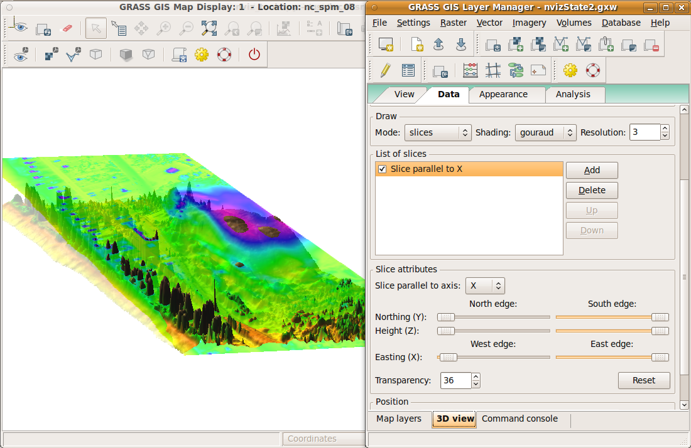
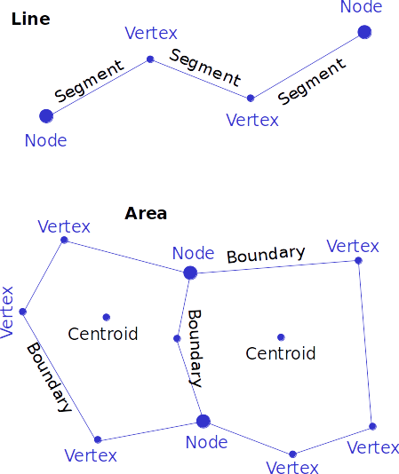
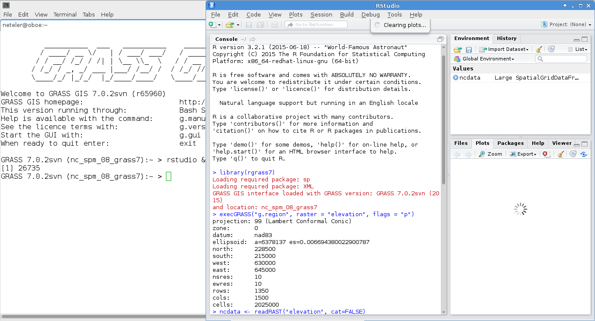

#What's GRASS GIS?

**G**eographic **R**esources  **A**nalysis **S**upport **S**ystem

**Open Source GIS**, developed since 1984, since 1999 GNU GPL

**Portable code** (many operating systems, 32/64bit)

Your **GIS backbone** – linkable to:

 

* Raster 2D/3D (voxel) processing

* Vector 2D/3D topological processing

* Vector network analysis support

* Image processing system

* Space-time cubes, temporal GIS

* Native raster and vector format

* 3D Visualization system

* DBMS integrated (SQL) with SQLite, DBF, PostgreSQL, MySQL and ODBC drivers

---
###graphical overview

GRASS GIS 7 capabilities: a [graphical overview](https://www.slideshare.net/markusN/grass-gis-7-capabilities-a-graphical-overview), a [graphical index](https://grass.osgeo.org/grass74/manuals/graphical_index.html)
 

---
###GRASS GIS 7 User interface
  
 

---
###GRASS GIS 7: Geospatial Modeller
* Extra Bonus:
 * Export to Python scripts

---
###Raster and 3D vector

| Elevation model combined with extruded 3D buildings| Trento, Italy Optional: KML export for virtual globes |
|----------------------------|-------------------------------|
| |  |
---
###GRASS Topological 2D/3D Vector model

**Vector geometry types**
* Point
* Centroid
* Line
* Boundary
* Area (boundary + centroid)
* face (3D area)
* [kernel (3D centroid)]
* [volumes (faces + kernel)]

* Geometry is true 3D when: x, y, z

**Use of Spatial Index**

---
###GRASS Topological Vector Digitizer

---
###GRASS GIS 7: Space-time functionality

 
---
#####t.register: Registers raster, vector and raster3d maps in a space time dataset

---
#####g.gui.tplot: plots the values of one or more temporal raster datasets for a queried point defined by a coordinate pair

---
###GRASS GIS 7 and R integration

There is a dedicated R packages “[rgrass7](https://grasswiki.osgeo.org/wiki/R_statistics/rgrass7)” for GRASS GIS data exchange

---
###Python API integration
[https://grasswiki.osgeo.org/wiki/GRASS_and_Python](https://grasswiki.osgeo.org/wiki/GRASS_and_Python)

---
###Using Python and GRASS GIS 7 with ipython
An interactive (Web based!) [shortcourse](https://github.com/wenzeslaus/python-grass-addon) on writing GRASS scripts in Python

---

###GRASS Addons: User contributed extensions

The [Addons](https://grass.osgeo.org/grass74/manuals/addons/) repository is SVN based:

One-click installation withextension manager

Increasing inflow of Python scripts

Users can easily obtain write access to develop new functionality

Peer review through SVN commitemail list

Also github, gitlab etc. now supported

---
##Where's the stuff?

#####GRASS GIS 7 Software:
Free [download](https://grass.osgeo.org/download/) for MS Windows, MacOSX, Linux and source code:

[Addons](https://grass.osgeo.org/grass7/manuals/addons/) (user contributed extensions):
		

#####Free sample data:
Rich [data set](https://grass.osgeo.org/download/sample-data/) of North Carolina (NC)
… available as GRASS GIS location and in common GIS formats
		

#####User Help:
[**Mailing lists**](https://grass.osgeo.org/support/) (also in different languages):
		
[**Wiki**](https://grasswiki.osgeo.org/wiki/)
		

[**Manuals**](https://grass.osgeo.org/documentation/manuals/)

